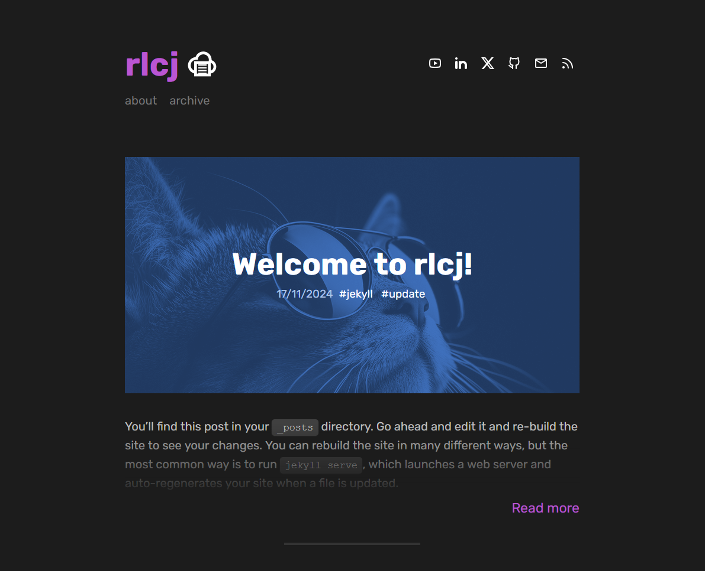

# rlcj

rlcj is a fast, modern and configurable [Jekyll](https://jekyllrb.com/) theme. It's main blog layout displays prominent hero images for posts and a clean, minimalistic design. It is designed to be easy to use and configure, with a focus on readability and performance.



## Features

Main Features:
* Customisable hero images for posts
* Animated icons from [iconify.design](https://iconify.design/)
* Responsive design

Jekyll-specific Features:
* Pagination
* Automatic page generation for tags
* Syntax highlighting with Rouge
* Configurable highlighting themes

## Warning

rlcj uses [jekyll-paginate-v2](https://github.com/sverrirs/jekyll-paginate-v2) which is not compatible with GitHub Pages. If you want to use this theme with GitHub Pages, you will need to build the site locally and push the generated files to your repository.

## Information about rlcj

This is effectively a fork of [dactl](https://github.com/melangue/dactl) that has been remade to work correctly with newer versions of jekyll. At time of creation, dactl's last update was 3 years ago, with most files being 7 years since last change. I couldn't get the theme to work when I forked it, so I decided to learn more aout Jekyll by slowly copy-pasting parts of dactl until something breaks, fixing the bug, and repeating. I've also made some changes to better suit my own needs.

I am very new to working with Jekyll, so I'm sure there are many things that could be improved. If you have any suggestions, please let me know. Or even better, fork the project and make the changes yourself!

## Installation
### Running locally

Assuming you've got Jekyll [installed](https://jekyllrb.com/docs/installation/), clone or download this repo, `cd` to wherever you've put the `rlcj` folder and run the following commands:

```bash
bundle install
bundle exec jekyll serve
```

### Hosting

As mentioned above, rlcj is not compatible with GitHub Pages due to the use of jekyll-paginate-v2. You can host your site on [Netlify](https://www.netlify.com/) or [GitHub Pages](https://pages.github.com/) by building the site locally and pushing the generated files to your repository.

I am currently testing Cloudflare Pages, and will update this section with instructions if it works.

## Changes from dactl

Many changes have been made to dactl. Some are changes to make the theme work with modern versions of Jekyll, while others are because I don't understand how certain things work and can't replicate them correctly. The original dactl preview website is broken in certain areas, so I can't compare the two themes side-by-side. Here are some of the major changes I've made:

- Changed icomoon font to use icons from [iconify.design](https://iconify.design/)
- Removed the search functionality in Archive
- Removed the Theme Switcher
- Changed the paginator to use jekyll-paginate-v2
- Use auto-pages for tags
- Change code highlighting theme to use Monokai

## License
All parts of dactl Jekyll theme are free to use and abuse under the open-source [MIT license](http://opensource.org/licenses/mit-license.php).

## Acknowledgements
- [dactl](https://github.com/melangue/dactl) for the original theme
- [iconify.design](https://iconify.design/) for the icons
- [jekyll-paginate-v2](https://github.com/sverrirs/jekyll-paginate-v2) for the pagination
